# Message Queue

## 目錄
* [Message Queue - 以 RabbitMQ 為例 ](#message-queue---以-rabbitmq-為例)
  * [Message Queue 的優點](#message-queue-的優點)
  * [Message Queue 的應用場景](#message-queue-的應用場景)
  * [Messaging System 中的標準組成元素](#messaging-system-中的標準組成元素)
  * [Message, Queue & Exchange 的關係](#message-queue--exchange-的關係)
* [Kafka](#kafka)
  * [問題出現](#問題出現)
  * [Kafka 架構](#kafka-架構)
  * [Kafka 資料儲存方式](#kafka-資料儲存方式)
  * [Kafka 解決了甚麼](#kafka-解決了甚麼)
* [Kafka vs RabbitMQ](#kafka-vs-rabbitmq)
  * [Memory-based vs Log-based](#memory-based-vs-log-based)
  * [如何選擇](#如何選擇)
* [Reference](#reference)


## Message Queue - 以 RabbitMQ 為例 

在一個系統中，一般不會只有一隻程式在運作，而是會有多隻程式同時負責各種不同的任務，而程式之間難免會有**互相傳遞資料**進行處理的需求，而這類的需求，以下都統稱為 applcation 的整合。

而一般常見的 application 整合方式大概可以分為以下幾種：

**Filed Based Integration**：

* source application 會根據需要處理的工作，產生新的檔案到特定的路徑

* 其他的 process application 則會是一直監控該路徑有沒有新檔案，有新的檔案則取出進行處理

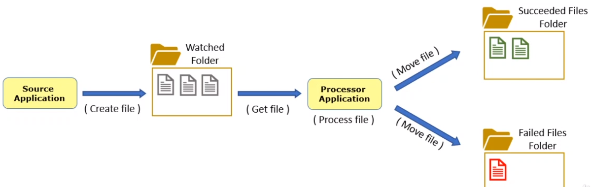

**Shared Database Integration**：

* source application 收到新任務時，或將資訊寫入 DB table 中

* processor application 則是持續監控 DB 中的特定 table，若有新紀錄則取出進行處理

* processor application 處理完工作後可能會將狀態回寫到 DB 中

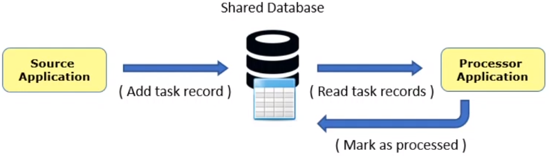

**Direct Connection Integration**：

* source application 直接傳遞訊息給 processor application

* 可能透過 TCP/IP 或是 named pipe connection 的方式傳遞資料

* 不限傳遞的資料格式，連線兩端的 application 傳遞的資料格式可自訂，可能是純文字、XML or JSON

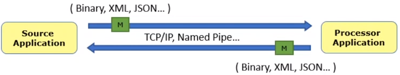

**Message Queue Integration**：

* 不限傳遞的資料格式

* 需要額外的 Message Queue middleware 的協助，也有可能被稱為 Message Broker 或是 Message Bus

* Message Broker 搜到訊息後(來自 producer application )會轉發給 consumer application

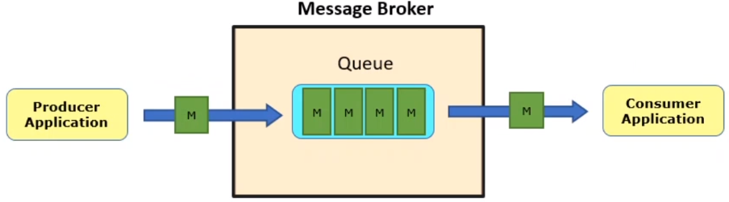

### Message Queue 的優點

> 到底在資料傳輸的過程中加入 Message Queue 充當中間人，可以帶來哪些好處 or 優點呢？

* 將 publisher & consumer 進行 decouple 了，因此程式開發人員可以各自專心負責規模較小 & 單純的程式開發工作。

* publisher & consumer 不需要知道雙方的實際的位置(例如：IP address)，只要將資料往 message queue 送就好

* 即使 consumer 短暫的無法提供服務也沒關係，message queue 可以將資料暫存起來，等待 consumer 重新上線時再送過去

* 比起持續 polling 的方式相對有效率的多

* 提供了一個可靠的方式，讓訊息傳遞 & 工作處理兩件事情可以用非同步的方式進行

* 當單一 consumer 不足以完成所有工作時，可以很容易的增加 consumer 數量進行水平擴展

### Message Queue 的應用場景

**Case 1**


從上圖可以看出，當 product 有任何更動時，需要後端資料庫的 search index 時，相關的資訊會先傳進 message queue，然後會有其他 worker(consumer) 接收進行處理。

**Case 2**

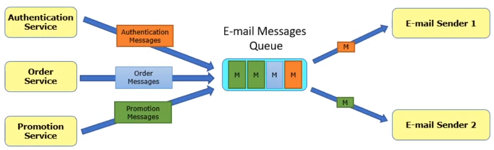

在一個電子商務網站，可能會因為以下不同的理由，以非同步的方式寄送 email 給會員：

* 驗證 E-Mail address

* 重設密碼

* 訂單確認

* 促銷活動

### Messaging System 中的標準組成元素

* Message：這是最主要的部份，簡單來說 message 就是要從一個 application 傳遞到另一個 application 的資料，可以是**很多形式**，例如：command、query 或是任何事件資訊；而每個 message 會包含兩個部份：

  * routing information
  * payload(實際資料)。

* Producer/Publisher：producer 是產生 message 並將其傳到 message broker

* Consumer/Receiver：收取來自 message broker 的 message 並進行處理

* Message Queue：是個存放來自 producer 的 message list，通常一個 messaging system 中會有多個 queue，而每個 queue 都會有一個識別名稱

* Message Broker：將 message 從傳送者轉發到 receiver 的一個中間者

* Router/Exchange：根據軟體設定，決定 message 傳遞的路徑，將不同的訊息轉發進不同的 queue 中

  * Routing 的概念在 RabbitMQ 中以 Exchange 來表示

* Connection：真實的 TCP 連接，像是 producer & message broker 之間的連接，或是 message broker 與 consumer 之間的連接

* Channel：在真實的 TCP 連接中定義出來的 virtual connection，這才是實際上 producer/consumer 與 message broker 之間的連接改念

* Binding：Binding 定義了 Exchange & Queue 之間的關係以及訊息 routing 的設定，可能還包含了一些 filter 的設定

### Message, Queue & Exchange 的關係

> 以下以 RabbitMQ 為例，來探討 Message, Queue & Exchange 的關係 & 屬性資訊(但差別與其他 Message Queue 的差異不大)

在 RabbitMQ 中，**Exchange** 是一個繞不開的概念：

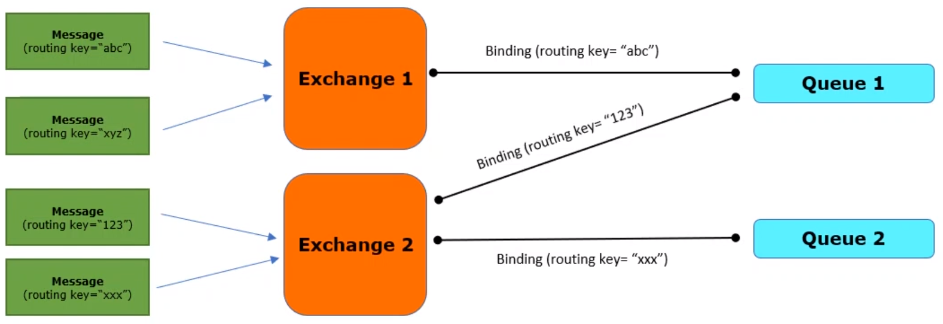

* Exchange 是 RabbitMQ 系統中負責轉發訊息的元件，Exchange 會根據使用者的設定，將訊息轉發到與其綁定的 Queue 上

* Message Producer 無法將訊息直接傳到 Queue 中，在 RabbitMQ 中訊息的第一個進入點是 Exchange

* 實際儲存訊息的 Queue 會根據使用者的設定，與不同的 Exchange 進行綁定

* 當 Exchange 收到訊息後，就會轉發到與其綁定的 Queue (可能 0 到多個不等)

* Exchange 僅能將訊息轉發到與其綁定的 Queue 上

* Exchange 有四種轉發模式，分別是 Fanout, Direct, Topic, Headers

* 至少會有一個預設 Exchange 存在於 RabbitMQ 系統中，稱為 default exchange，轉發的模式為 direct；每個新建立的 Queue，若是沒指定 exchane 資訊，就會與預設的綁定

> 至於 RabbitMQ 中的 broker，就是 **Exchange + Queue** 的組合體，訊息會先進入 Exchange，再由 Exchange 轉發到 Queue 中，最終 consumer 會從 Queue 中取出訊息進行處理。

**Message 的屬性**

* Routing Key：用來決定訊息進入到 Messaging System 後如何被轉發的資訊

* Headers：key/value 的資訊集合，可用來作為訊息 routing 之後或是傳遞 publisher 想要傳遞的額外訊息

* Payload：實際所要傳遞的資料

* Publishing TimeStamp(optional)：publisher 所提供的 timestamp 資訊

* Expiration：Message 可停留在 Queue 中的存活時間，超過 expiration 的設定則 message 會視為 dead 而不會傳送

* Delivery Mode：會有 persistent or trasient 兩個選項，而 persistent 會將 message 寫入 disk 中，即使 RabiitMQ 服務重啟，訊息也都不會遺失，而 trasient 則不會

* Priority：message 的優先權(0~255, 這個需要 Queue 支援才可以)

* Message ID(optional)：由 publisher 給入，用來識別 message 的 ID 資訊

* Correlation ID(optional)：在 RPC 場景中用來匹配 request & response 用的資訊

* Replay To(optional)：在 request-response 場景中會使用到的 exchange 或是 queue 的名稱

**Queue 的屬性**

* Name：唯一的名稱，最多 255 個字元的 UTF-8 字串

* Durable：指定在 RabbitMQ 重啟後保留 or 移除 Queue 的依據

* Auto Delete：沒有任何訂閱者的情況下是否自動移除

* Exclusive：只服務特定一個 connection，一旦該 connection 斷掉就會移除 Queue

* Max Length：最多可以停留在 Queue 中的 message 數量，可以指定若超過會從最舊的訊息開始移除或是拒絕新的 message 進入

* Max Priority：priority 可設定的最大值

* Message TTL：存入到 Queue 中的 Message 的 TTL(若是 Message & Queue 都有 TTL 的設定，會以較低的為主)

* Dead-letter Exchange：可用來指定過期 or 被丟棄的 message 被自動傳送到某一個 exchange

* Binding Configuration：Queue & Exchange 之間的關聯資訊 (每個 Queue 都必須與某個 Exchange 綁定，確保可以從 Exchange 取得 message)

**Exchange 的屬性**

* Name：Exchange 的名稱(必須唯一)

* Type：Exchange 的運作類型，會是 Fanout, Direct, Topic, Headers 四種之一

* Durability：與 Queue Durability 相同，用來決定在 RabbitMQ 服務重啟後會不會依然存在

* Auto Delete：設定是否在沒有任何 Queue 綁定的情況下，就自動移除

* Internal：若設定為 Internal，表示僅能接收來自其他 exchange 的 message，無法接收來自 publisher 的 message

* Alternate Exchange：指定無法 route 的 message 的去向

* Other Arguments(x-arguments)：Exchange 其他的 metadata，可能會用於其他的 plugin 中

## Kafka

### 問題出現

隨著使用者變多，勢必會更高頻率的呼叫 api 與存取資料庫；假使我們沒有設計任何的緩衝機制，那資料庫就會崩潰。

### Kafka 架構

Kafka 也是一種**消息隊列(Message queue)**：
* **生產者(Producer)**會往隊列結尾塞東西，**消費者(Consumer)**從隊列依次拿東西。

```bash
[Producer]  [Kafka cluster]                         [Consumer]
              ├── Broker1                           
Producer0->   │     ├── Topic A
              │     │     ├── Partition0(Leader)  -> Consumer Group A
              │     └── Topic B                         ├── Consumer0
              │           └── Partition0(Follower)      └── Consumer1
              └── Broker2
                    ├── Topic A
                    │     ├── Partition0(Follower)
                    └── Topic B
Producer1->               └── Partition0(Leader)  -> Consumer Group B
                                                        ├── Consumer0
                                                        └── Consumer1
```

* Producer：生產者，為消息的入口。發佈消息到一個或多個 Topic 上，並指定 Partition。

* Kafka cluster：Kafka 的集群，由多個 Broker 組成。
  * Broker：Kafka 的實體，可以把它想像成每個 Broker 對應一台 Server。每個 broker 接收來自 producers 的訊並寫入至磁碟中，同時回應來自 Consumers 的資料請求
  * Topic：消息的主題，有點像是資料庫的 Table。
    * Partition：Topic 內切分為數個 Partitions，在 Kafka 中每個最小單位的訊息 (message) 或記錄 (record) 以序列 append 的方式存放在在每個 Partition 中，Partition 可以分散式的存放在不同機器中，以防止單台機器故障。
    * Replication：你在架構上會發現有些 Partition 是 Leader，有些是 Follower，Leader 是真正的資料讀寫來源，Follower 僅是一個副本(有 0 或多個)。當 Leader 故障時，會從 Follower 中選出新的 Leader；且 Leader 跟 Follower 會在不同的機器上，避免故障後一起陣亡。

* Consumer：消費者，為消息的出口。

* Consumer Group：可以將多個消費者組成一個消費群組，在 Kafka 的設計中，一個 Partition 的數據只允許消費群組中的**某個**消費者消費，消費群組中的消費者可以消費同一個 Topic 不同 Partition 的數據。

通常狀態下，一個 Consumer Group 的 Consumer 數量，建議與 Partition 的數量相同；下面我們把 Partition 當成一碗飯，Consumer 比喻為一個人，這樣會更好理解為何要這樣設計：

* 可以出現一個人吃多碗飯的情況。（吃太飽了）
* 不能出現多個人吃一碗飯的情況。（不能搶飯吃）
* 如果人比飯碗多，那就得有人餓著。
* 一人一碗，剛剛好（理想設計）。

### Kafka 資料儲存方式

* Kafka 將資料儲存於**硬碟**上，為消息提供了**持久化**的服務(相對於記憶體)，這樣的設定對消費者來說很好，他可以按造順序消費，也可以重新消費過去的消息(不過硬碟容量有限，還是會使用「空間 or 時間」作為淘汰策略)

### Kafka 解決了甚麼

* 使用前：

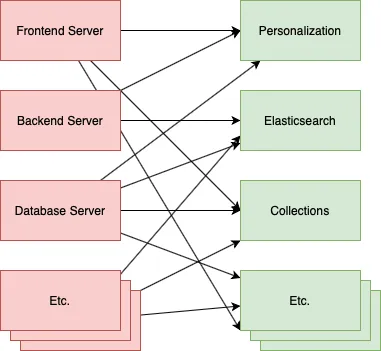
> 上述場景中造成的許多缺點，如每個應用之間都需要知道彼此的 API 接口才能串接，或是如果一方暫時故障無法回應，可能就會失去資料。

* 使用後：

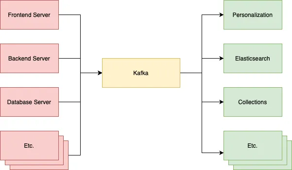


## Kafka vs RabbitMQ

Message broker 通常分為兩種：

* Memory-based：RabbitMQ

* Log-based：Kafka

在討論兩者差異之前，我們先來討論底下的幾種狀況：

* **Multiple Consumers**：當有多個 consumers 時，訊息會被如何處理？

  * Load Balancing：一條 message 只會被一個 consumer 處理，所以可以將多個 consumers 都指派到同一個 Topic，以達到平行處理不同任務的效果。

  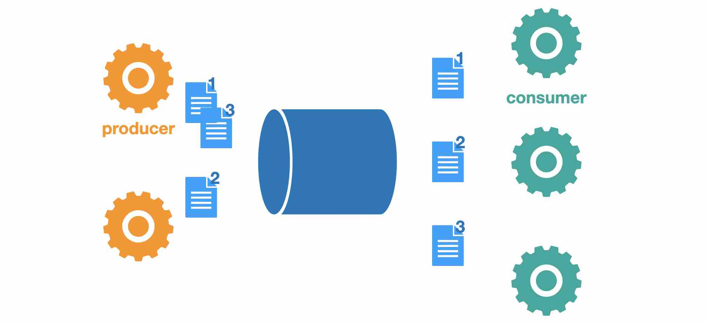

  * Fanout：一條 message 會被所有的 consumers 處理，像是 broadcast，可以用在 message 需要給多個 consumers 處理的情況，例如一條交易消息可以同時傳給資料庫、使用者圖表。

  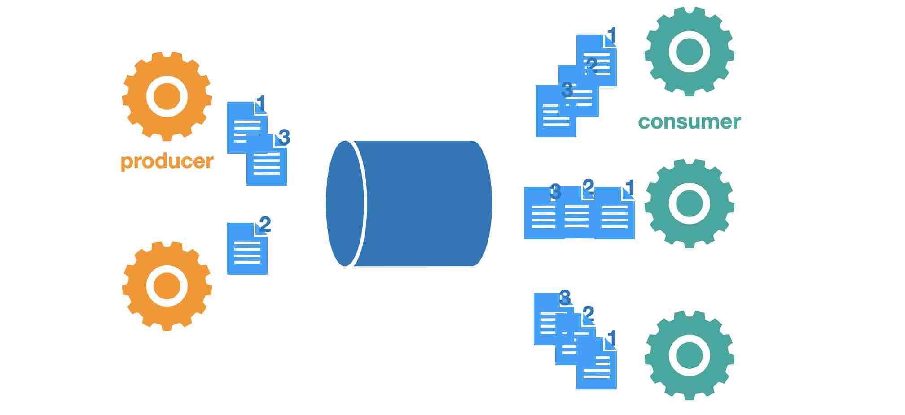

* **Persistence**：當broker掛掉時，已經發送過來的messsage會消失嗎？還是等到broker重啟之後，會再重新發送？

* **Acknowledgements**：當consumer工作到一半掛掉時，如何確保每個message已經被完整地處理好了呢？

因為consumer也可能隨時會掛掉，可能在收到訊息之前，或收到訊息但工作到一半時， broker為了確保訊息有好好地到達，會使用acknowledgement， acknowledgement就是必須由consumer告訴broker，他已經收到message，broker可以將該message從queue中移除了， 至於ack的時機不同會導致訊息被處理的次數的保證的不同：

  * At most once：consumer在收到訊息後，就立刻回傳ack。所以就算consumer在處理訊息時掛掉，該訊息也會被視為處理過了，不會再被處理第二次。可能的狀況就是訊息被「正確」的處理 0 次 or 1 次。

  * At least once：consumer在收到訊息後，只有在處理完訊息後，才回傳ack。所以就算consumer在處理訊息時掛掉， 因為還沒ack，broker會再發送這個訊息出來， 所以最差的情況就是訊息被處理到多次，正常的情況就是處理一次，而且至少一次。

### Memory-based vs Log-based

* **Memory-based**：

  這類系統顧名思義，主要使用**memory**作為message存放的地方，當consumer ack了某個信息後， 就把它刪掉了，完全不留痕跡。當然很多系統也可以透過設置，決定要不要將信息寫到硬碟上， 不過主要是用來做recovery的，確保broker本身掛掉時，message不會丟失， 當確認了message已經成功抵達了它要到的地方後，一樣會把它刪掉。

  此類系統著重的是**message從producer到consumer的過程**，而不是留下一個永久的狀態或結果。

  而信息的傳送是由broker主動push給consumer的。

* **Log-based**：

  而log based的系統則是相反，只有要message進來，就都寫到硬碟上，是一個append only log， 當consumer要消耗信息時，就是讀取檔案上的資料，讀到盡頭了就等通知， 等有新的資料繼續被append到檔案中，有點像是Unix tool tail -f 的感覺。

  為了不讓寫入的速度被限制一個硬碟上，需要將一個topic的log partitioned， 每個partition由一台機器負責，可以獨立地讀寫。

  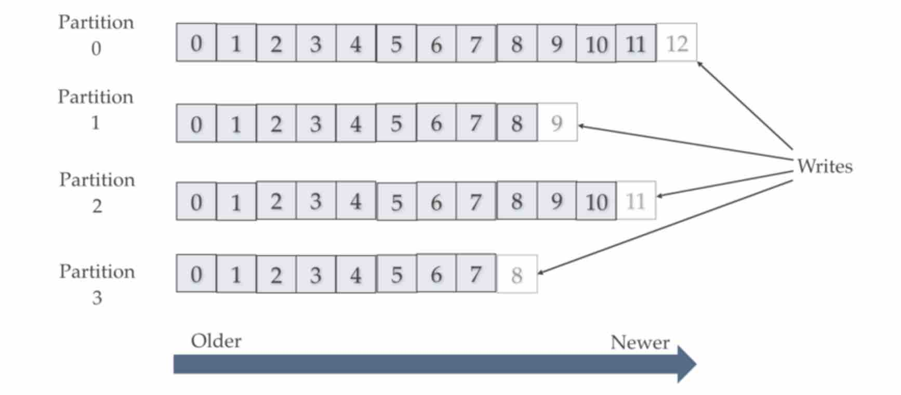

### Kafka vs RabbitMQ

先看表格，底下再詳細討論：

| 特性 | RabbitMQ | Kafka |
| --- | --- | --- |
| Load Balancing | Yes | Yes, but limited |
| Fanout | Yes, through exchange binding | Yes |
| Persistence | Yes, through configuration | Yes |
| Inorder delivery | Yes, conditionally | Yes, , per partition |

**Load Balancing**：

* Memory-based：自然地support了load balancing，當有message時， broker輪流地向跟他有建立連結的consumer推送信息，就達成了load balancing的效果， 越多consumer，就可以平行處理越多的工作。

* Log based: 無法天生支援load balancing，因為每個consumer彼此是各自獨立的，分別從頭、 或從某個地方開始讀取log檔案，所以想達成load balancing，是透過partition的方法:

  假設我現在有一個topic，並且將它partition成三份，此時就可以assign三個consumer給他， 看起來就像是這一個topic的message被分給三個consumer，而實際上是每一個partition對應到一個consumer， 所以，**可同時平行處理這個topic的consumer的數量，也就會是partition的數量**(Yes, but limited)。

**Fanout**：

* Memory based: 需要透過額外的設計才能達成，RabbitMQ implememt的AMQP協議， exchange binding可以實現pub-sub的patter。

* Log based: 自然地support fan-out，每個consumer對log檔案想讀哪就讀哪，想重複讀幾次就讀幾次。

**Persistence**：

* Memory based：透過設置，可以同步將message寫入硬碟，確保不會丟失，不過就只保存到當consumer成功消耗之前。

* Log based: 如前面所述，每個message都會寫入硬碟，除非你說要刪掉它，不然就會一直在。

**Inorder delivery**：

* Memory based: 無法保證message一個一個按照順序的被處理，除非每一個topic只有一個consumer。

* Log based: 每個partition上的message，一定是被consumer做一個sequential read的動作， 所以信息一定會被按照順序讀取，但不同partition之間就沒有順序的保證，他們基本上是獨立的。

### 如何選擇

最後就來看看在哪些場景比較適合使用哪一種產品吧！根據以下幾個問題及情境分別回答:

* 是否需要被保存下來?

  如果你想要message被保存下來，那就用log based的messaging system，保存下來有哪些好處呢？

  可以肆無忌憚地去consume message，可以去嘗試、做實驗，不用怕message會不見、方便做 event sourcing。

* 工作昂不昂貴?

  如果處理一個message的工作量是很大的，需要耗費很多時間才能做完，比較不會用log based的產品，為什麼呢?

  1. 它無法使用大量的consumer來平行地處理所有的工作，因為可以平行工作的consumer的數量受限於partition的數量

  2. 在一個partition裡，只要有個message需要耗費很多的時間，就會造成塞車，也就是head of line blocking。


* 順序重要嗎?

  有些類型的message彼此是獨立不相干的，被處理順序是如何並不重要，就沒一定要使用log based的產品， 但當你需要保留message的順序時，唯有log based的messaging system可以給你保證，不過**只限定於同個partition**。

  有哪些例子是順序重要的呢? 比如說對一個使用者的帳戶餘額做加減乘除的運算，順序不同結果就不同， 但你可以使用user id作為partition key，則在每一個partition裡保持對的順序就好，不同的partition間的順序就不重要了。


## Reference

* [正在為大數據所苦嗎？帶你了解 Kafka 這個分布式消息串流平台，以及它能解決什麼問題！](https://medium.com/dean-lin/%E6%AD%A3%E5%9C%A8%E7%82%BA%E5%A4%A7%E6%95%B8%E6%93%9A%E6%89%80%E8%8B%A6%E5%97%8E-%E5%B8%B6%E4%BD%A0%E4%BA%86%E8%A7%A3-kafka-%E9%80%99%E5%80%8B%E5%88%86%E5%B8%83%E5%BC%8F%E6%B6%88%E6%81%AF%E4%B8%B2%E6%B5%81%E5%B9%B3%E5%8F%B0-%E4%BB%A5%E5%8F%8A%E5%AE%83%E8%83%BD%E8%A7%A3%E6%B1%BA%E4%BB%80%E9%BA%BC%E5%95%8F%E9%A1%8C-4fd74d106a79)

* [RabbitMQ和Kafka有何不同？何時該選用哪種產品？](https://homuchen.com/posts/difference-bwtween-rabbitmq-and-kafka/)

* [Message Queue 簡介(以 RabbitMQ 為例)](https://godleon.github.io/blog/ChatOps/message-queue-concepts/)

* [如何实现 Message Broker | RabbitMQ 内核解析](https://blog.acecodeinterview.com/rabbitmq/)

