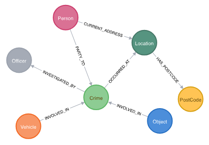

## DB

# 目錄

* [額外補充：何謂「分散式」?](#額外補充何謂分散式)

* [RDBMS vs. NOSQL](#rdbms-vs-nosql)
  * [使用時機](#使用時機)
  * [NOSQL 比 RDBMS 快嗎?](#nosql-比-rdbms-快嗎)
  * [為什麼 RDBMS 的擴充性(scalability)比較低？](#為什麼-rdbms-的擴充性scalability比較低)

* [MongoDB (NOSQL)](#mongodb-nosql)
  * [在 MongoDB 中插入一筆資料](#在-mongodb-中插入一筆資料)

* [Graph Database](#graph-database)

* [Apache Hadhoop -> Hive -> Presto](#apache-hadhoop---hive---presto)

## 額外補充：何謂「分散式」?

以前：拿一台電腦處理任務，效能瓶頸就垂直擴充，提升 CPU、RAM、硬碟等等。

現在：拿多台電腦處理任務，效能瓶頸就水平擴充，增加更多電腦，分散處理。

## RDBMS vs. NOSQL 

* **關聯式資料庫**(RDBMS, Relational Database Management System)：

    關聯式資料庫管理系統，意即資料庫是由多個 Table 所組成，並且可以將資料表關聯起來，去連結多個資料表之間的關係。諸如 MySQL, PostgreSQL, MS SQL, … 都是關聯式資料庫。

    以下列出幾個關聯式資料庫的特點：

    * Database 由 Table 組成，其中 row 代表一筆資料，column 代表資料欄位名稱。
    * Schema 必須先定義好，並且只接受同樣格式資料的插入與修改。往後如果要修改 schema，必須對於已存在的資料做相對應的處理較為麻煩
    * 可以使用 JOIN 來連結多個資料表，做較複雜的查詢
    * 具備 [ACID 特性](https://medium.com/appxtech/%E8%B3%87%E6%96%99%E5%BA%AB-%E6%B7%BA%E8%AB%87%E9%97%9C%E8%81%AF%E5%BC%8F%E8%B3%87%E6%96%99%E5%BA%AB%E8%88%87acid%E7%89%B9%E6%80%A7-83a1b4178981)
    * 使用 SQL(Structured Querying Language) 來管理及查詢資料

* **非關聯式資料庫**(NOSQL)

    NOSQL(Non-SQL，又為 Not only SQL) 稱為非關聯式資料庫，跟關聯式資料庫不一樣，不需要定義 schema、沒有關聯的關係。諸如 MongoDB, Redis, … 都是非關聯式資料庫的一種。以下為非關聯式資料庫的幾個特點：

    * Database 由 collection 組成
    * collection 中每筆資料為一份 document，document 的資料格式不需一致
    * 常見的資料格式：
      * JSON
      * key-value
      * document(xml, yaml, html)
    * 以 [CAP theorem](https://medium.com/%E5%BE%8C%E7%AB%AF%E6%96%B0%E6%89%8B%E6%9D%91/cap%E5%AE%9A%E7%90%86101-3fdd10e0b9a) 為概念設計
    * 常用於分散式雲端系統

### 使用時機

**為什麼使用 RDBMS?**

需要確保 **ACID** 特性的情境。RDBMS 類型的資料庫，保證了 ACID，保證了資料的一致性。舉例在金融類型的應用，你會希望匯入匯出的錢，能夠同步一致的更新到資料庫上，以防重複扣款或是餘額顯示錯誤等等的狀況。而 NOSQL 是沒有保證 ACID 的，所以在這種情況下，RDBMS 相較於 NOSQL 更適合。

整體來看，SQL 的適用情況：

* 資料格式明確，未來不會大幅的變動
* 資料之間的關聯很重要
* 想要更有效率的讀取資料
* 未來會大量使用到 JOIN 的功能
* 更著重在資料操作的準確性與一致性 (ACID)

**為什麼使用 NOSQL?**

由於 NOSQL 的 schema 不需要固定，且資料可以為任意結構。所以在 schema 需要頻繁變動或者是 schema 不固定的時候，NOSQL 提供更有彈性的開發。比如在開發初期，schema 會需要頻繁更新，這時候 NOSQL 就比較適合。

需要**儲存大量資料，利用分散式系統以及雲端儲存**的時候。由於 NOSQL 相較於 RDBMS 更容易做 horizontal scaling，且本身的設計就是分散式系統的設計。因此對於未來有大量擴充需求的系統，會更容易的去擴充，且擴充的成本也較低。

整體來看，NOSQL 的適用情況：

* 想快速啟動小專案進行 POC(Proof of Concept)
* 資料格式未來很有可能調整
* 資料之間沒有複雜的關聯、跨區統計需求較少
* 大用量的查找需求

### NOSQL 比 RDBMS 快嗎?

RDBMS 以及 NOSQL 在查詢上最主要的差別在於，RDBMS 可以執行較複雜的查詢，因為 RDBMS 具有關聯的特性，例如有顧客、商品、銷售員三個資料表，分別儲存顧客的個人資料、商品的詳細價格與類別以及銷售員的個人資料，RDBMS 此時可以將三個表依照指定邏輯將他們關聯起來，建立一個含有某個顧客，從某個銷售員手上，購買的某個商品，這樣子的一個資料表。因此 RDBMS 在查詢上，可能需要跟很多資料表做關聯，等於是多查詢了很多個資料表，因此查詢的時間相對比較長。

對比的 NOSQL，因為不包含任何關聯，單筆資料查詢後的所有需要的資料，都存在這一筆資料中，不需要做其他額外的查詢，相較之下會比 RDBMS 快。

### 為什麼 RDBMS 的擴充性(scalability)比較低？

RDBMS 比較容易做 vertical scaling，vertical scaling 意思是將單一台 server 做硬體的升級(例如增加 CPU, memory … 等等)，花費相較於 horizontal scaling 高。

至於為什麼 RDBMS 較不容易做 horizontal scaling 呢？

一個原因是 RDBMS 具有 ACID 的特性，因此當一個 transaction 要修改某個資料時，會將其他也要操作這個資料的 transaction 先 lock 住，以防 race condition，接著等到這個 transaction 做完後，才同意讓其他 transaction 繼續進行下去。所以這樣的機制下，會降低到資料庫的效能。

也因為上述的狀況，假設今天要將 RDBMS 做 horizontal scaling 的擴充，這時需要被 lock 的 Table 可能分佈在不同的 server 上面，這時要找出哪些 Table 要被 lock，以及該 Table 在哪一台 server 上面，都會嚴重降低資料庫效能，而且系統的複雜度也遠比單一台 server 要複雜許多！

對比之下， NOSQL 本身就是基於分散式系統架構，且不具備 ACID 的特性，因此更適合 horizontal scaling。在做水平擴充之後，只需要把資料分散儲存到各個 server 中，不用去處理資料之間的關聯性。比起關聯式資料庫，能夠更簡單的做到 horizontal scaling。

## MongoDB (NOSQL)

複習：nosql 由 collection 組成，collection 中每筆資料為一份 document，document 的資料格式不需一致。

例如：

```json
{
    name: 'Suki',
    job: 'backend developer',
    bloodType: 'A'
},
{
    name: 'Jam',
    job: 'fullstack developer',
    bloodType: 'A'
}
```

上面定義了兩個 user，如果今天我只想紀錄 Jam 的興趣呢？

```json
{
    // 其他 user 不被影響
    name: 'Suki',
    job: 'backend developer',
    bloodType: 'A'
},
{
    // 加上 hobbbies 紀錄 user 的嗜好
    name: 'Jam',
    job: 'fullstack developer',
    bloodType: 'A',
    hobbies: ['hiking', 'podcast', 'sleeping']
}
```
> 使用 NoSQL 資料庫時，有關聯的資料常常會被儲存在同一個 document 中。

### 在 MongoDB 中插入一筆資料

```bash
use myNewDB
db.posts.insertOne( { title: 'hello mongoDB', author: 'suki' } )
```

## Graph Database

運用圖結構的概念來儲存資料，並運用圖結構相關演算法提高性能，不是專門用來處理圖片的資料庫。例如用樹狀結構來組織從屬關係或網狀結構來儲存朋友關係。

其最大的特性是對複雜性的擴充力，**關係越複雜**的資料越適合使用圖形資料庫。以節點、邊和屬性來表示和儲存資料。



> 每個圓圈都是一個 Node - 節點，代表一筆資料，而每個 Node 都可以有很多 Relation - 關係，而每一個關係可以是單向或是雙向

## Apache Hadhoop -> Hive -> Presto

**Apache Hadoop**

核心組件：

* 分佈式文件系統（HDFS, Hadoop Distributed File System）：用於大規模數據的存儲。
* MapReduce 計算框架：用於分佈式數據處理。
* MapReduce 的挑戰：雖然 MapReduce 強大，但其編程模型對開發人員要求較高，需要編寫複雜的代碼來實現數據處理邏輯。

**Apache Hive**

目的：Facebook 開發 Hive 以降低使用 MapReduce 的門檻，讓數據分析人員能夠使用熟悉的 SQL 語法進行查詢。

Hive是基於Hadoop的數倉工具，可對存儲在HDFS上的檔中的資料集進行資料整理、特殊查詢和分析處理，提供了類似於SQL語言的查詢語言–HiveQL，可透過HQL語句實現簡單的MR統計，Hive將HQL語句轉換成MR任務進行執行。

核心創新：

* HiveQL：引入類 SQL 語言，使用戶可以用 SQL 語法處理數據。
* SQL 到 MapReduce 的轉換：將 SQL 查詢自動轉換為 MapReduce 作業。
* 數據倉庫功能：提供表格管理、分區、索引等功能。
* 限制：由於底層依賴 MapReduce，Hive 的查詢延遲較高，不適合實時查詢，主要用於批處理場景。

**Presto**

背景：Facebook 為克服 Hive 的性能限制，於 2012 年開發了 Presto。

主要特點：

* MPP 架構：採用大規模並行處理架構，不依賴 MapReduce。
* 內存計算：支持內存計算，顯著提升查詢性能。
* 多數據源支持：可以查詢多種數據源，包括 HDFS、關係型數據庫、NoSQL 等。
* 標準 ANSI SQL：支持標準的 ANSI SQL。

**上述三者的關係**

數據存儲層面：

* HDFS：作為基礎存儲層。
* Hive 和 Presto：都可以讀取 HDFS 中的數據。

計算層面：

* Hive：依賴 MapReduce 進行計算。
* Presto：採用自己的 MPP 引擎，不依賴 MapReduce。

適用場景：

* Hive：適合大規模批處理。
* Presto：適合交互式查詢。

使用場景：

* ETL 處理：通常使用 Hive。
* 查詢：通常使用 Presto。

> 數據分析：兩者結合使用，發揮各自優勢。

在現代數據架構中，這三個技術通常協同工作：

* HDFS：負責數據存儲。
* Hive：負責數據倉庫管理和 ETL。
* Presto：負責數據查詢和分析。
